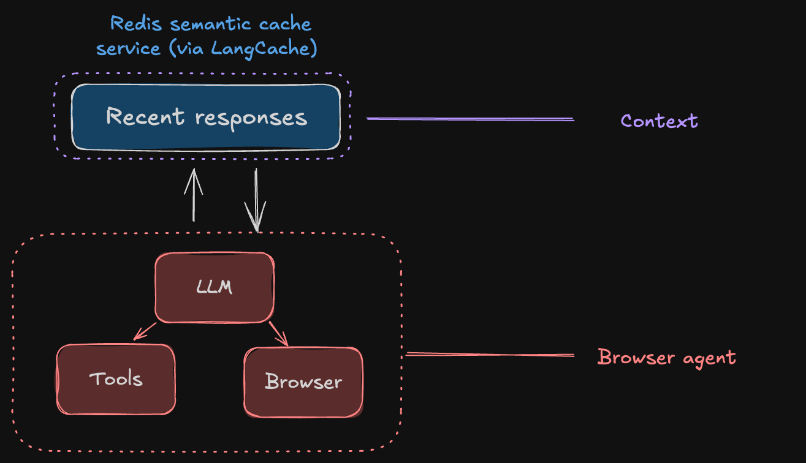

# BrowserBrain AI

> **2x memory for browser agents**

Browserbrain AI implements a semantic context caching layer for browser agents.

## 🎯 Why?

Browser agents have poor context. They struggle with:
- Limited memory retention across tasks
- Expensive + long agent hallucinations impose risk for production use

## 🚀 Solution

This project combines **Browser Use** (browser automation library) with **Redis** to provide:
- **LangCache from Redis**: Fast retrieval of previously successful query trajectories and similar contexts

## 🏗️ Architecture

### System Architecture Diagram



Our architecture implements a sophisticated three-tier context engineering system designed to overcome LLM context limitations and enable truly autonomous browser agents with persistent memory.

### Architecture Layers

#### 1. Context Layer

The **Context Layer** provides persistent, intelligent memory storage that transcends simple browser agents.

#### 2. Intermediary Layer

The **Intermediary Layer** acts as the intelligent orchestrator. It decides what should or shouldn't be in long term memory (learned trimming). This layer could be removed and replaced with heuristic trimming (fixed static trimming of context) but recent trends show that LLM-based context engineering is more effective.

#### 3. Browser Agent Layer

The **Browser Agent Layer** executes tasks autonomously. Browser use package we use can be customised; add built-in tools and custom tools.  

### Technical Components

- **Server** (`/server`): Python backend (using `uv`)
  - Uses `browser-use` for browser automation
  - Integrates with Redis for context storage and caching
  - Implements RAG-indexed memory for semantic retrieval
  - Provides LangCache functionality for query trajectory caching
  - Provides API endpoints for browser agent operations

- **Client** (`/client`): Next.js frontend
  - Web interface for interacting with browser agents
  - Visualize context and memory management
  - Real-time interaction with the browser automation API

## 🛠️ Tech Stack

- **Backend**: Python 3.12+, FastAPI, Browser Use, Redis, uvicorn
- **Frontend**: Next.js 16, React 19, TypeScript, Tailwind CSS
- **Infrastructure**: Docker, Docker Compose
- **Package Management**: `uv` for Python dependencies

## 📦 Installation & Setup

### Prerequisites

- Docker & Docker Compose
- Set up environment variables

### Running the Project

Start all services:
```bash
docker compose watch
```

Rebuild containers before starting:
```bash
docker compose build
```

Stop services:
```bash
docker compose down
```

Stop and remove volumes:
```bash
docker compose down -v
```

View logs in realtime:
```bash
docker compose logs -f
```


## 🤝 Contributing

This is a hackathon project. Contributions welcome!

## 🤙 Contact
> GitHub [@hireshb](https://github.com/hireshb) &nbsp;&middot;&nbsp;
> Twitter [@hiresh_b](https://x.com/hiresh_b)